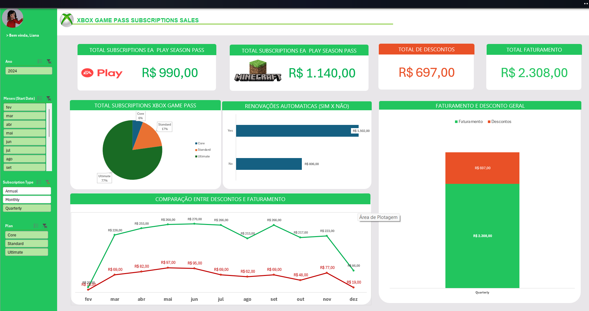

# Dashboard de Business Intelligence: Análise de Assinaturas Xbox

## 📊 Visualização do Dashboard Final

## 1. Objetivo do Projeto

Desenvolver um dashboard de Business Intelligence em Microsoft Excel para analisar a performance de vendas de planos de assinatura da plataforma Xbox. O objetivo principal é transformar dados brutos transacionais em um painel gerencial interativo, que permita a extração de insights rápidos e suporte à tomada de decisão estratégica sobre produtos, canais de venda e faturamento.

Este projeto foi realizado como Desafio de Projeto do Bootcamp Klabin.

## 2. Metodologia e Processo de Desenvolvimento

O desenvolvimento do dashboard seguiu um processo estruturado, simulando um mini-projeto de BI:

1.  **Extração e Carga de Dados:** A base de dados, contendo o registro de cada assinatura vendida, foi carregada no Excel para tratamento.
2.  **Transformação e Modelagem (ETL):** Foi realizada a limpeza e o enriquecimento dos dados. A etapa mais importante foi a criação de uma **coluna calculada ("Mês")** a partir do campo de data, permitindo a criação de análises temporais de forma mais eficiente.
3.  **Análise com Tabelas Dinâmicas:** Foram criadas múltiplas tabelas dinâmicas para agregar e sumarizar os dados sob diferentes perspectivas (receita por mês, assinaturas por plano, etc.), servindo como base para todos os elementos visuais.
4.  **Visualização e Interatividade:** Com base nas tabelas dinâmicas, foram construídos os gráficos, KPIs e a segmentação de dados (Slicers), consolidando todas as informações em um painel único e de fácil interpretação.

## 3. Ferramentas e Fórmulas Chave

* **Tabelas Dinâmicas:** Utilizadas como motor de toda a análise, permitindo agrupar e calcular dados de forma flexível e performática.
* **Gráficos Dinâmicos:** Gráficos de barras, colunas e pizza conectados diretamente às tabelas dinâmicas para garantir a atualização automática com a aplicação de filtros.
* **Segmentação de Dados (Slicers):** Implementados para oferecer uma experiência de filtragem interativa e intuitiva para o usuário final.
* **Fórmulas:**
    * **Coluna "Mês":** Criada utilizando a função `=TEXTO(célula_da_data; "mmmm")` para extrair o nome do mês, essencial para os gráficos de tendência.
* **KPIs (Indicadores-Chave):** Cartões de valor único para destacar as métricas mais importantes (Receita Total, Quantidade, Ticket Médio) e dar um panorama imediato da performance.

## 4. Análises e Insights Gerados

O dashboard foi projetado para responder a perguntas de negócio estratégicas:

* **KPIs Principais:** Fornecem uma visão macro e instantânea da saúde do negócio.
* **Receita Mensal:** Permite identificar tendências, sazonalidades e o impacto de campanhas de marketing ao longo do tempo.
* **Assinaturas por Plano:** Revela o mix de produtos, mostrando qual plano é o carro-chefe em volume de vendas.
* **Receita por Forma de Pagamento:** Mostra a preferência dos consumidores, podendo guiar decisões sobre taxas e parcerias com provedores de pagamento.
* **Top 5 Lojas por Receita:** Identifica os canais de venda de maior performance, permitindo focar investimentos e estratégias.

## 5. Estrutura do Repositório

* `/imagens/`: Contém o screenshot do dashboard finalizado.
* `Dashboard_Assinaturas_Xbox.xlsx`: O arquivo principal do Excel, que contém a base de dados, as tabelas dinâmicas, os cálculos e o dashboard interativo.
* `README.md`: Esta documentação detalhada.

---

_Projeto desenvolvido por Bruno Albuquerque como parte do Bootcamp Klabin._
